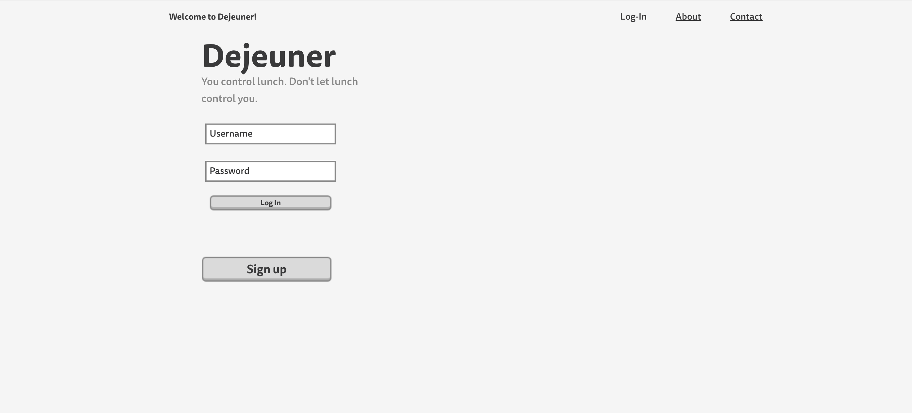
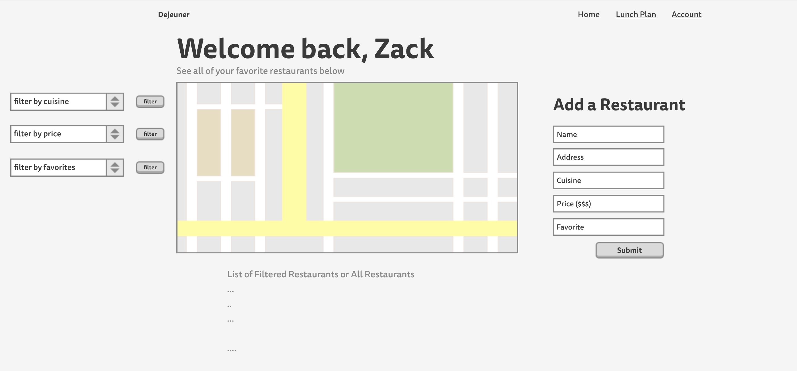
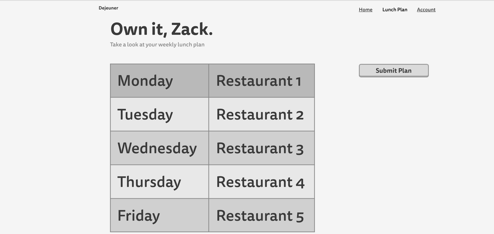
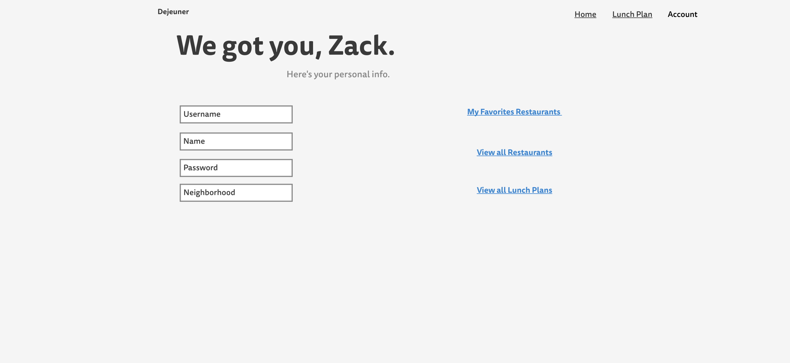
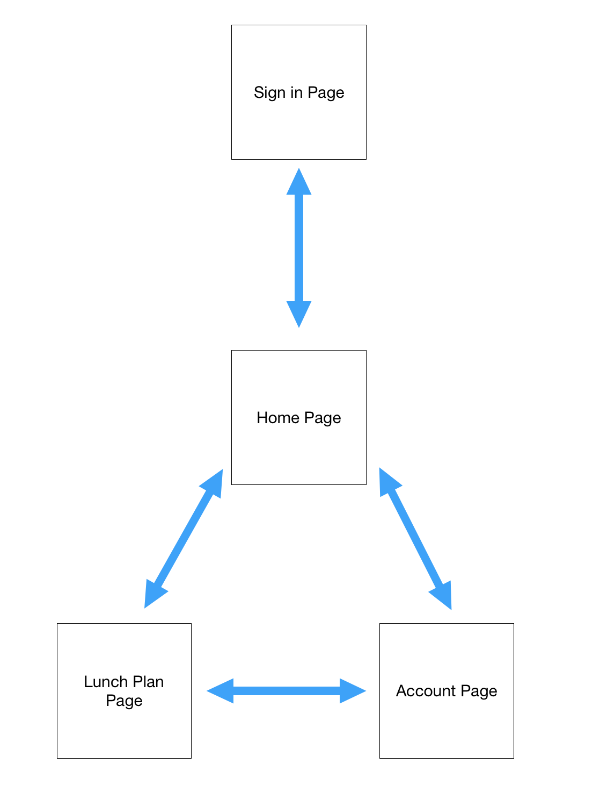

# [See deployed work here](https://guarded-sands-89367.herokuapp.com/)

# Dejeuner

## Overview

New York City is a city full of life, culture, commerce, and food! I don't know about you, but I have the
unfortunate struggle of not knowing what/where I will eat for lunch every day. Because I do not plan ahead,
when lunch-time is calling, I am hAngry, I have no idea where to eat, and I often make regrettable and non-nutritional decisions in the spur of the moment. This is where Dejeuner comes in!

Dejeuner is a web app that will allow users to keep track of their favorite lunch spots around town. Users can register and login. Once they're logged in, they can create or view their own curation of restaurant options. They can add new favorite hubs to their list whenever they please, filter their search based on important factors like price and cuisine type, and users also have the ability to "De-Dejeuner"! --> a feature that enables user to create a "proactive" lunch plan for the upcoming week, so they no longer need to do it on the fly! All of the user data is tracked and saved, so the user can freely log in and out whenever.


## Data Model

The web application will store Users, Restaurants, and Weekly Plan data models. Users will have access
to all restaurants stored in their own data store (there will be some pre-populated already to help foster usability), and will have the ability to add new locations, filter by cuisine, meal options, price, and more. Users will have the ability to make Weekly Lunch Plans, which include a Monday through Friday pre-planned assignment of where the user will eat. These plans will be stored, and ultimately the user can make changes to their plan whenever.

User Schema will include the following info depicted below. Note that the user general info is stored as entered, except for their password, which is encrypted and hashed in to the database to preserve safety and user protection.

An Example User:

```javascript

{
  firstname: "zachary",
  lastname: "kimelheim",
  username: "zacharykimelheim",
  password: "4bns87652eh5jk43h54jk5h35k2l34hglj45glkj5h2lkjhlkh2vckh"// a password hash,
  Restaurants: //an array of references to Restaurant documents
  Lunch_Plans: //an array of references to plans created
}
```

Restaurant Schema will include the following information below. Note that the latitude and longitude data is stored to allow map population featuring when loading the Google Map on the homepage, filled with all of the user's saved restaurants.  

An Example Restaurant:

```javascript

{
  userId: //a reference to a User object ID that was responsible for creating this restaurant
  name: "East Village Thai",
  address: "205 E 7th Street, New York, NY 10003",
  latitude: "-704.25",
  longitude: "781.86",
  cuisinetype: "Thai",
  price: "$",
}
```

An Example of a Lunch Plan:
```javascript
{
  user: //a reference to a User object
  Monday: "East Village Thai",
  Tuesday: "Joe's Pizza",
  Wednesday: "Wagamama",
  Thursday: "Shake Shack",
  Friday: "Dos Toros"
}
```

## [Link to Commented First Draft Schema](db.js)

## Wireframes

/login - page for logging in/creating an account



/home - page for showing all restaurant information for user to tamper with



/plan - page for showing editable lunch plan



/user - user account page



## Site map



## User Stories or Use Cases

1. as non-registered user, I can register a new account with the site
2. as a user, I can log in to the site
3. as a user, I can add a restaurant
4. as a user, I can view all restaurants I've added
5. as a user, I can filter restaurants based on certain data
6. as a user, I can create a weekly lunch plan schedule
7. as a user, I can view my personal account info

## Research Topics

* (3 points) Use a new CSS Framework
    * I plan to use materialize.css to enhance my front-end skills
* (4 points) Integrate Google Maps API/Visual
    * I plan to learn how to implement the Google Maps API, with pinned locations to appear on the map
    * I've always wanted to learn how to implement this important feature, which can be used for many things
    * It's completely new to me, so I wanted to work a lot on this, which is why I've given it 4 points
* (5 points) Integrate user authentication
    * I plan to create general log in and registration with passportJS (no 3rd party registration like Google or Facebook)
    * As a new user, you can register by filling in the fields (must be unused email and username)--> and immediately after submitting form (assuming everything is entered correctly), the page will reload and you can now enter your username/password fields to log in  

## [Link to Initial Main Project File](app.js)


## Annotations / References Used

I used the following tutorials and documentation to help me with my research topics.

PassportJS Tutorial -- https://www.youtube.com/watch?v=Z1ktxiqyiLA
Materialize CSS Docs -- http://materializecss.com/
Google Maps API Docs -- https://developers.google.com/maps/documentation/javascript/
